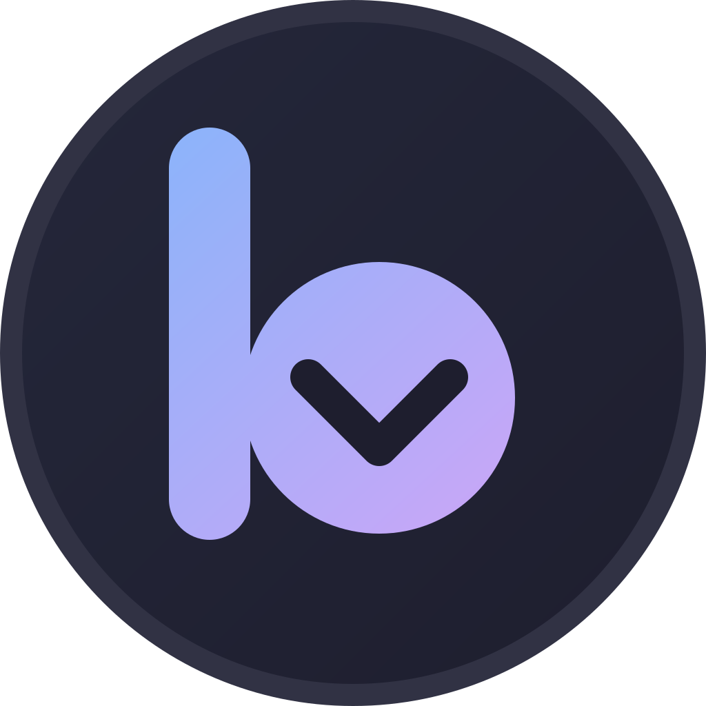

<div align="center">
  
  <h1>betterBit</h1>
  <p>A supercharged qBittorrent fork — smarter columns, cleaner UI, better defaults.</p>

  [](https://github.com/qbittorrent/qBittorrent)
  []()
  []()
  []()

  **[⬇ Download for macOS](https://github.com/kingomarwashere/betterBit/releases/latest)** &nbsp;·&nbsp; **[betterbit.theradicalparty.com](https://betterbit.theradicalparty.com)**
</div>

---

## What's different

betterBit is a personal fork of qBittorrent with quality-of-life patches applied on top of the stable release. All changes are in the [`betterBit`](https://github.com/kingomarwashere/betterBit/tree/betterBit) branch.

### New columns *(right-click the header row to enable)*

| Column | Description |
|--------|-------------|
| **Added (Relative)** | Shows `2 days ago` instead of a raw timestamp |
| **Stalled For** | Time since last transfer activity — only appears when the torrent is stalled |
| **File Types** | Detected content type: `Video`, `Audio`, `Archive`, `Subtitles`, etc. |
| **Clean Name** | Scene/anime release tags stripped — `Show.Name.S01E01.1080p.BluRay-GROUP` → `Show Name S01E01` |
| **Download Duration** | Total elapsed download time for the torrent |

### Display improvements

- **Ratio progress bar** — the Ratio column renders as a fill bar capped at the ratio limit (or 2.0)
- **Smart rename pre-fill** — the rename dialog opens with the Clean Name already filled in
- **Free space warning** — row highlights amber when the save path has less free space than the torrent still needs

### Logic improvements

- **ETA smoother** — speed sample buffer doubled (30 → 60 samples, ~1 min rolling average) for calmer ETA estimates
- **Auto-categorise by tracker** — maps tracker domains to categories automatically on torrent add; configure via `Preferences → BitTorrent → TrackerCategoryMap`
- **Duplicate detection** — the duplicate torrent dialog now has a *Show in list* button that scrolls to and selects the existing torrent

---

## Search

betterBit ships 20 search engine plugins out of the box and opens the search panel by default — just start typing.

| Plugin | Source |
|--------|--------|
| `piratebay` | The Pirate Bay |
| `nyaa` | Nyaa.si — anime/manga |
| `nyaasi` | Nyaa.si (mirror) |
| `leetx` | 1337x |
| `ettv` | ETTV |
| `eztv` | EZTV — TV shows |
| `kickasstorrents` | KickassTorrents |
| `torrentgalaxy` | TorrentGalaxy |
| `torlock` | Torlock |
| `limetorrents` | LimeTorrents |
| `bt4g` | BT4G |
| `bitsearch` | Bitsearch |
| `snowfl` | Snowfl |
| `solidtorrents` | Solid Torrents |
| `torrentdownload` | TorrentDownload |
| `torrentscsv` | Torrents.csv |
| `linuxtracker` | LinuxTracker — distros |
| `sukebei` | Sukebei — Nyaa adult sister site (18+) |
| `pornbay` | PornBay — TPB adult categories via apibay (18+) |

Plugins live in [`src/searchengine/nova3/engines/`](src/searchengine/nova3/engines/) — drop any additional `.py` plugin there and it appears automatically.

---

## Themes

Two themes are bundled in the [`themes/`](themes/) directory.

| File | Style |
|------|-------|
| `catppuccin-mocha.qbtheme` | Dark pastel — default |
| `cyberpunk.qbtheme` | High-contrast neon dark |

**To apply:** `Settings → Behavior → Interface → Use custom UI theme` → browse to the `.qbtheme` file.

---

## Building

betterBit **requires** libtorrent built with WebTorrent (WebRTC) support. The standard Homebrew libtorrent does not include it — run the bundled script once to build the right deps, then build normally.

See [`INSTALL`](INSTALL) for the full dependency list (Qt6, Boost, OpenSSL, etc.).

### Step 1 — build deps (one-time, ~10 min)

```bash
git clone https://github.com/kingomarwashere/betterBit.git
cd betterBit && git checkout betterBit

./scripts/build-webtorrent-deps.sh
```

Builds libtorrent `v2.1.0-rc2` (which bundles libdatachannel) and installs everything to `~/.local/betterbit-deps`.

### Step 2 — build betterBit

```bash
cmake -B build -DCMAKE_BUILD_TYPE=Release \
      -DCMAKE_PREFIX_PATH="${HOME}/.local/betterbit-deps"
cmake --build build --parallel
```

The app bundle lands at `build/betterBit.app` on macOS.

WebTorrent connects betterBit to browser-based peers (e.g. [webtorrent.io](https://webtorrent.io)) using WebRTC. It is always active — no extra configuration needed.

---

## Upstream

betterBit tracks [qbittorrent/qBittorrent](https://github.com/qbittorrent/qBittorrent). Feature branches are rebased onto new upstream releases before being squashed into the `betterBit` branch.

> All credit for the core client goes to the qBittorrent project and its contributors.
